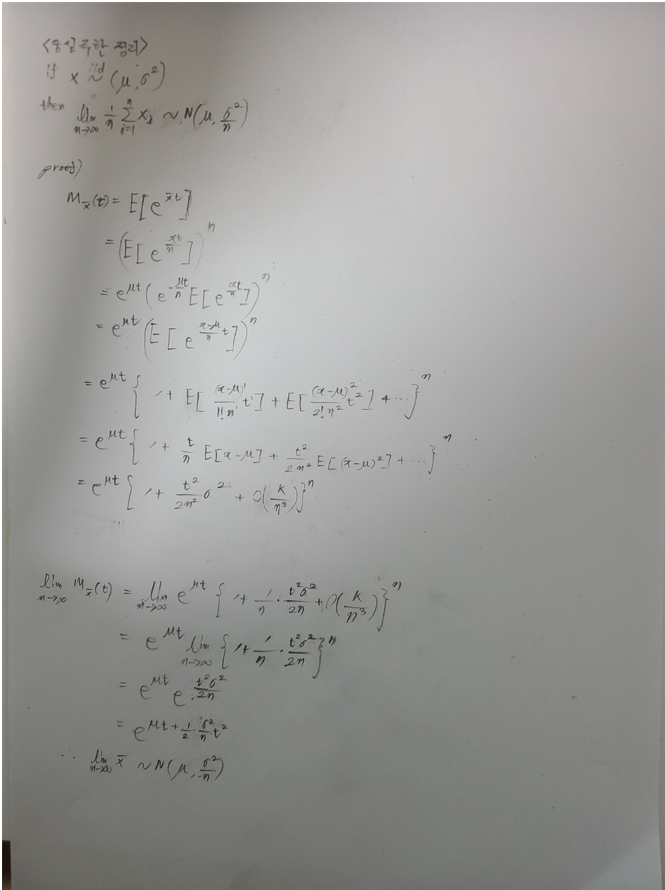
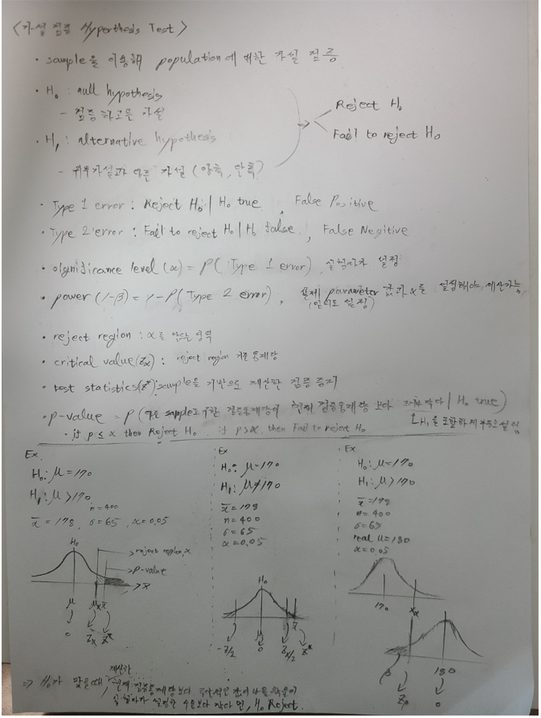
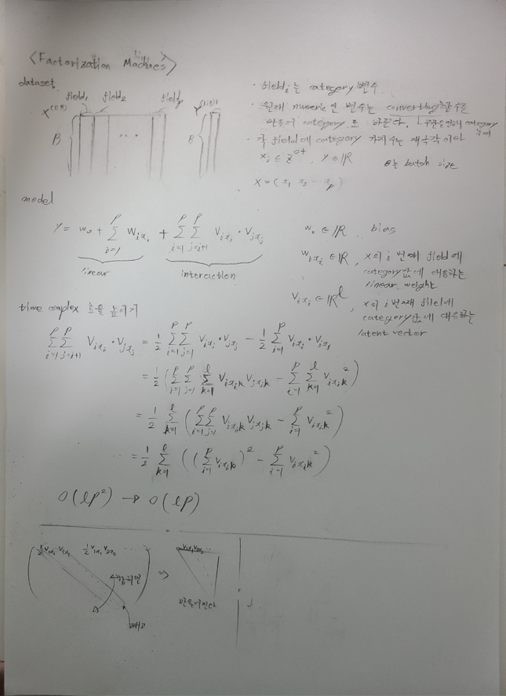

# 목차
- [목차](#목차)
- [Probability & Random Variable](#probability--random-variable)
  - [Measure Theory](#measure-theory)
  - [Famous Probability Distribution](#famous-probability-distribution)
  - [Random Variable Operation](#random-variable-operation)
    - [Momentum](#momentum)
    - [Convolution](#convolution)
  - [Moment Generate Function](#moment-generate-function)
  - [Characteristic Function](#characteristic-function)
  - [Central Limit Theory](#central-limit-theory)
- [Parameter Estimation](#parameter-estimation)
  - [maximum likelihood estimation](#maximum-likelihood-estimation)
  - [Expectation Maximization Algorithm](#expectation-maximization-algorithm)
  - [bayes rule: prior distribution & posterior distribution](#bayes-rule-prior-distribution--posterior-distribution)
- [Information Theory](#information-theory)
- [Hyperthesis Test](#hyperthesis-test)
  - [student's t test](#students-t-test)
  - [ANOVA](#anova)
  - [normality test](#normality-test)
  - [Chi-square test(Discrete Varaible Goodness of Fit Test)](#chi-square-testdiscrete-varaible-goodness-of-fit-test)
  - [Komogorov Smirnov test(Continuous Variable Goodness of Fit Test)](#komogorov-smirnov-testcontinuous-variable-goodness-of-fit-test)
- [Treatment Effect](#treatment-effect)
- [Regression](#regression)
  - [Leaner Regression](#leaner-regression)
  - [Investment Variable](#investment-variable)
  - [generalized additive model](#generalized-additive-model)
- [Classification](#classification)
  - [Confution Matrix](#confution-matrix)
  - [logistic regression](#logistic-regression)
  - [decision tree](#decision-tree)
  - [k nearest](#k-nearest)
  - [gradient boosting](#gradient-boosting)
  - [xgboost](#xgboost)
  - [svm](#svm)
  - [ensemble](#ensemble)
- [Recommend System](#recommend-system)
  - [TopK Prediction](#topk-prediction)
    - [NDCG, Hit Ratio](#ndcg-hit-ratio)
    - [Apriori Algorithm](#apriori-algorithm)
    - [Collaborative Filtering](#collaborative-filtering)
    - [Matrix Factorization](#matrix-factorization)
    - [Bayesian Personalized Ranking](#bayesian-personalized-ranking)
    - [Grpah Convolution Network](#grpah-convolution-network)
  - [CTR Prediction](#ctr-prediction)
    - [Factorization Machines](#factorization-machines)
- [Dimension Reduction](#dimension-reduction)
  - [PCA Principal Component Analysis](#pca-principal-component-analysis)
  - [AutoEncoder](#autoencoder)
- [Pattern Recognition for Feature Extraction](#pattern-recognition-for-feature-extraction)
  - [FeedForward Neural Network](#feedforward-neural-network)
  - [Convolution Neural Network](#convolution-neural-network)
  - [Recurrent Neural Network](#recurrent-neural-network)
  - [Transformer](#transformer)
  - [BERT: Bidirectional Encoder Representations from Transformers](#bert-bidirectional-encoder-representations-from-transformers)
- [Time Series](#time-series)
  - [ARIMA](#arima)
  - [GARCH](#garch)
  - [Frequency Domain](#frequency-domain)
- [Stochastic Process](#stochastic-process)
  - [poisson process](#poisson-process)
  - [gaussian process](#gaussian-process)
  - [markov process](#markov-process)
  - [brown motion](#brown-motion)
  - [hidden markov model](#hidden-markov-model)
- [sampling](#sampling)
  - [markov chain monte carlo](#markov-chain-monte-carlo)
  - [gibbs sampling](#gibbs-sampling)
  - [VAE](#vae)
  - [GAN](#gan)
- [Game Theory](#game-theory)
  - [static games under complete information](#static-games-under-complete-information)
  - [dynamic games under complete information](#dynamic-games-under-complete-information)
  - [static games under incomplete information](#static-games-under-incomplete-information)
  - [dynamic games under incomplete information](#dynamic-games-under-incomplete-information)
- [ReinForceLearing](#reinforcelearing)
  - [Markov Decision Process](#markov-decision-process)
  - [Deep Q Learning](#deep-q-learning)
  - [Policy Gradient](#policy-gradient)

# Probability & Random Variable
## Measure Theory

## Famous Probability Distribution

## Random Variable Operation
### Momentum
- Expectation
- Variance
- covariance
### Convolution
- convolution

## Moment Generate Function

## Characteristic Function

## Central Limit Theory

# Parameter Estimation
- estimation, estimator, estimate
- point estimation
- interval estimation
## maximum likelihood estimation
## Expectation Maximization Algorithm
## bayes rule: prior distribution & posterior distribution

# Information Theory
- entropy
- cross entropy
- KL divergence
  
# Hyperthesis Test

## student's t test
## ANOVA
## normality test
## Chi-square test(Discrete Varaible Goodness of Fit Test)
## Komogorov Smirnov test(Continuous Variable Goodness of Fit Test)

# Treatment Effect

# Regression
## Leaner Regression
## Investment Variable
## generalized additive model

# Classification
## Confution Matrix 
## logistic regression
## decision tree
## k nearest
## gradient boosting
## xgboost
## svm
## ensemble
  - bagging(bootstrap aggregating)
  - boosting

# Recommend System
## TopK Prediction
### NDCG, Hit Ratio
### Apriori Algorithm
### Collaborative Filtering
### Matrix Factorization
### Bayesian Personalized Ranking
### Grpah Convolution Network

## CTR Prediction
### Factorization Machines

# Dimension Reduction
## PCA Principal Component Analysis
## AutoEncoder

# Pattern Recognition for Feature Extraction
## FeedForward Neural Network
## Convolution Neural Network
## Recurrent Neural Network
## Transformer
## BERT: Bidirectional Encoder Representations from Transformers

# Time Series
## ARIMA
- MA(p) moving average
- AR(q) auto regrssion
- ARIMA
## GARCH
- ARCH
- GARCH
## Frequency Domain
- fourier transform

# Stochastic Process
## poisson process
## gaussian process
## markov process
- discrete time markov process
- continuous time markov process
## brown motion
- brown motion
- geometric brown motion
## hidden markov model

# sampling
## markov chain monte carlo
## gibbs sampling
## VAE
## GAN

# Game Theory
## static games under complete information
## dynamic games under complete information
## static games under incomplete information
## dynamic games under incomplete information

# ReinForceLearing
## Markov Decision Process
## Deep Q Learning
## Policy Gradient
